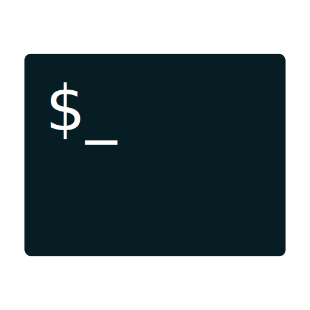

# Jogo da forca

### Sobre

Nada melhor do que um simples jogo da velha para treinar a manipulação de strings.


### 📌 Conteúdo

* [Sobre](#sobre)
* [Status](#status)
* [Características](#características)
* [Requisitos](#requisitos)
* [Tecnologia](#tecnologia)
* [Autor](#autor)
* [Licença](#licença)

### Status

Projeto concluído ✅

### Características

- [x] Interação via terminal
    
    


### Requisitos

1. Para rodar a aplicação é necessário a instalação do [Python 3](https://www.python.org/downloads/).

2. O próximo passo é clonar este repositório para algum local do computador
por meio do terminal ou cmd:

```bash
    $ git clone https://github.com/MatheusBibiano/Forca.git
```

3. Feito isso, agora é só navegar para dentro da pasta do projeto e executar:

* Linux
```bash
    $ python3 main.py
```

* Windows
```powershell
    $ python main.py
```

### Tecnologia

A seguinte tecnologia foi utilizada na construção do projeto:

- [Python](https://www.python.org/)

### Autor


Matheus Bibiano Alves

[](https://www.linkedin.com/in/matheus-bibiano-alves) [](https://www.facebook.com/matheus.bibiano1/) [](https://twitter.com/Bibiano_Alves)

### Licença

[MIT](https://choosealicense.com/licenses/mit/)
